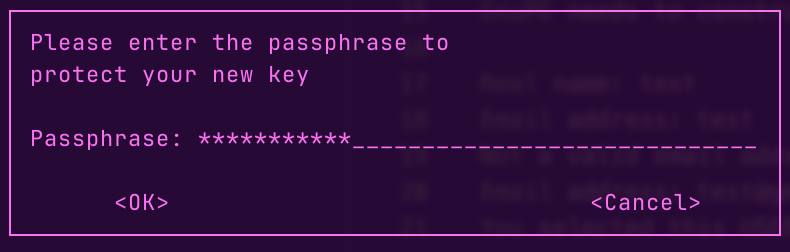

# Keyper CLI Walk-Through: 

## GPG Initialisation: 

```
➜  ~ gpg --gen-key
gpg (GnuPG) 2.4.3; Copyright (C) 2023 g10 Code GmbH
This is free software: you are free to change and redistribute it.
There is NO WARRANTY, to the extent permitted by law.

Note: Use "gpg --full-generate-key" for a full featured key generation dialog.

GnuPG needs to construct a user ID to identify your key.

Real name: test
Email address: test
Not a valid email address
Email address: test@gmail.com
You selected this USER-ID:
    "test <test@gmail.com>"

Change (N)ame, (E)mail, or (O)kay/(Q)uit? O
```


You need to use **YOUR** `GPG_KEY_ID` (in this example it's: `E7E6DCCCA0FB20D85F0E3D67C093FFB8AD98F576`) to initiate `keyper` CLI:
```
➜  ~ gpg --gen-key
gpg (GnuPG) 2.4.3; Copyright (C) 2023 g10 Code GmbH
This is free software: you are free to change and redistribute it.
There is NO WARRANTY, to the extent permitted by law.

Note: Use "gpg --full-generate-key" for a full featured key generation dialog.

GnuPG needs to construct a user ID to identify your key.

Real name: test
Email address: test
Not a valid email address
Email address: test@gmail.com
You selected this USER-ID:
    "test <test@gmail.com>"

Change (N)ame, (E)mail, or (O)kay/(Q)uit? O
We need to generate a lot of random bytes. It is a good idea to perform
some other action (type on the keyboard, move the mouse, utilize the
disks) during the prime generation; this gives the random number
generator a better chance to gain enough entropy.
We need to generate a lot of random bytes. It is a good idea to perform
some other action (type on the keyboard, move the mouse, utilize the
disks) during the prime generation; this gives the random number
generator a better chance to gain enough entropy.
gpg: revocation certificate stored as '/Users/Reticent/.gnupg/openpgp-revocs.d/E7E6DCCCA0FB20D85F0E3D67C093FFB8AD98F576.rev'
public and secret key created and signed.

pub   ed25519 2023-08-30 [SC] [expires: 2026-08-29]
      E7E6DCCCA0FB20D85F0E3D67C093FFB8AD98F576
uid                      test <test@gmail.com>
sub   cv25519 2023-08-30 [E] [expires: 2026-08-29]
```

## Keyper Initialisation: 

`keyper init <YOUR_GPG_KEY_ID>`

```
➜  ~ keyper init E7E6DCCCA0FB20D85F0E3D67C093FFB8AD98F576
mkdir: Created .secretKeyper directory at -->  /Users/Reticent/.secretKeyper
SecretKeyper initialised for GPG Key --> E7E6DCCCA0FB20D85F0E3D67C093FFB8AD98F576
```

## Git Initialisation: 

```
➜  ~ keyper git init
Git repository initialized in the secretKeyper directory.
```

-----

The CLI is now set up! You're ready to try out other commands 😎